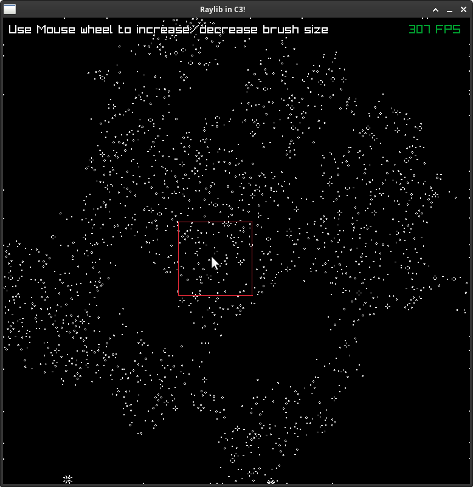

## Compute shaders with Raylib (and C3)

A demo to show compute shaders working on raylib via C3 bindings.  
It is a mostly 1-1 translation from [here](https://github.com/c3lang/vendor/blob/main/libraries/raylib55.c3l/raylib.c3i) to get familiar with the language.

The ones used are from [NexusasTaken](https://github.com/NexushasTaken/raylib.c3l), but have been modified to fix some bugs.  
Also, to enable compute shaders, raylib must be built with [some flags](https://github.com/NexushasTaken/raylib.c3l/issues/8).  
The amd64 linux library shipped has been replaced with one which does, so that the demo can work.

If you don't trust random binaries exchanged on the internet (you really should not!) please build it yourself.
